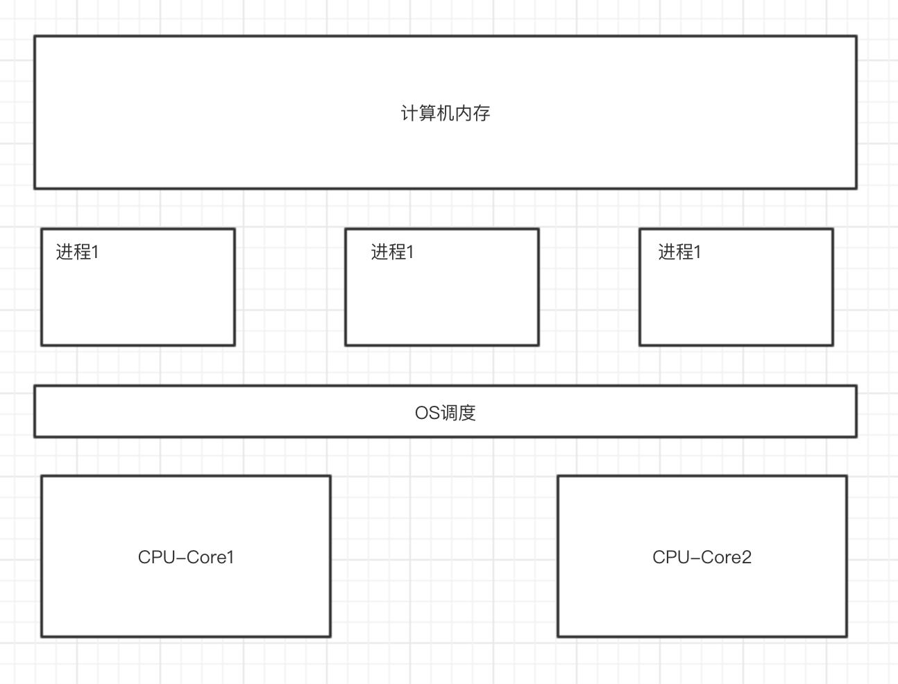
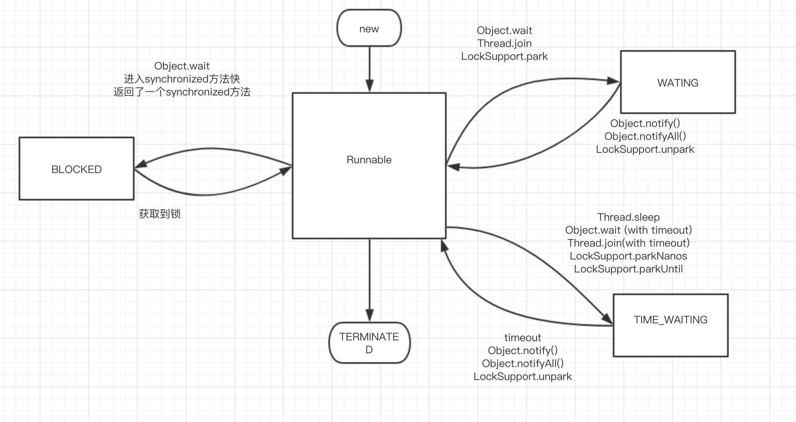

## Part 1

### 多线程发展历史

  随着计算机的发展，现在的机器的处理能力有了及大的提升，为了充分利用CPU多核心的能力，多线程开始被广泛使用。多线程为了解决”等待“的问题，在同一时间内利用先走资源做更多的事情。

  进程：进程在CPU的一个时间片内只能做一种事情。

  线程：在一个进程下多个线程可以共同去执行很多个子任务。 线程是真正意义上的并行。




### 应用场景


1、通过并行来提高应用的执行效率。

2、通过多线程，来缓解网络IO，本地文件IO的阻塞问题。（意思就是，使用单独线程去做耗时的操作，其他线程同步完成其他操作）

Tomcat 在7 之前 用的BIO的模型。

```
client                                           thread
client                  server                   thread
clienr                                           thread
```


### 如何使用多线程

1、继承Thread 重写run 方法，创建线程的时候只要创建当前类，然后start即可

2、实现Runnable ，Thread实际上也是实现了Runnable  ，实现Runnable，并实现run方法，然后创建thread的时候传入当前类即可

3、实现Callable方法，然后通过Executors.submit 传入实现的类，通过future来接受，当你想要获得当前线程执行的结果的时候用此种方法。


### 优雅的使用多线程

合理的利用异步来处理。

zookeeper里面的设计理念就有用异步实现。

链式编程，请求进来，先存到自己队列，然后处理自己的队列，而后处理完之后，调用传进来的另一个处理器的处理方法，依次类推。每一个处理操作都可以单独抽象出来，然后三个操作同时开启线程跑，这样就大大提高了处理效率。（很重要）


### JAVA并发编程的基础

#### 线程的状态

创建，执行，阻塞，等待，超时等待，执行完毕

- NEW  初始化状态，创建线程 还没有执行start()

- RUNNABLED  运行中

- BLOCKED 阻塞，表示线程进入等待状态，也就是因为某种原因放弃CPU的使用权，

  1、等待阻塞 运行当前线程的wait方法，会把当前线程放入等待队列中。

  2、同步阻塞 运行的对象获得锁时，倘若锁被其他线程占用，则当前线程会被放入锁池中

  3、其他阻塞 当sleep 或者join 或者发出了IO请求是，JVM会把当前线程设置为阻塞状态，当sleep结束，join终止，IO结束时会恢复线程。

- WAITING 等待   LockSupport#park() Object#wait() #join()

- TIME_WAITING  超时等待

- TERMINATED 线程终止


#### 线程的生命周期




查看状态 

jps 列出java 进程

jstack pid 打出java 堆栈信息


#### 优雅的关闭线程

interrupt 是一个标记，标记当前线程是否被销毁，这个标记为可以被其他线程改变，自身也可以改变。

需要在代码内部设置，如果销毁标志位true 则执行完代码即可。不需要继续执行下去。（至于什么时候中断， 取取决于线程自身，自身通过判断状态来中断）

调用interrupt 来终止线程 通过其他线程调用interrupt来告知当前线程可以销毁，


1、通过标记位来判断是否结束

```java
/**
* 通过在线程内判断interrupt的状态来选择终止线程。 当外部线程调用此线程的interrupt的时候，标记位会被改变
* 如果被终端，返回true 否则返回false
*/
while(!Thread.currentThread().isInterrupted()){
i++;
}
```


2、通过修改标记位置，来永久执行下去

```java
//复位标志 测试当前线程是否已经中断。线程的中断状态 由该方法清除。 清除中断的状态
Thread.interrupted() 
    
```


3、当当前线程处于不可被中断的状态时，调用interrupt会抛出异常，并复位

```java
如果线程在调用 Object 类的 wait()、wait(long) 或 wait(long, int) 方法，或者该类的 join()、join(long)、join(long, int)、sleep(long) 或 sleep(long, int) 方法过程中受阻，则其中断状态将被清除，它还将收到一个 InterruptedException。
```


***另一种方式***

设置volatile 通过标记位置来终止线程，代码interrupt内部的标记而已。没什么实质上的区别


### 线程的安全问题

安全问题总结为 可见性、原子性、有序性。

安全性问题的来源是因为CPU高速缓存导致，为了增加处理效率，将存储在内存中的数据缓冲在CPU高速缓存中，运算结束后再从缓存同步到内存当中。


#### 缓存一致性问题

  如果两个CPU同时将主内存的值缓存到告诉缓存当中，任何一个CPU修改数据之后就会造成缓存不一致的问题，

引发这个问题的原因是因为CPU多核心导致，所以为了解决为题，CPU厂商提供了响应的解决方案。

***总线锁***

当CPU缓存数据的时候向总线中发一个Lock的信号，其他处理器的请求会被阻塞，那么该处理器就可以独占共享内存，总线锁就相当于把CPU和内存之间的通信锁住，这种方式会导致CPU功能下降。所以就又出现了一种新的处理方式，缓存锁

***缓存锁***

如果数据被缓存在告诉缓存中，则不会声明lock信号，而是通过锁定缓存，并回写到内存当中并由缓存一致性机制来确保修改的原子性，缓存一致性机制会组织两个CPU同时修改内存中的数据。


***缓存一致性协议***

MESI


```
1、程序顺序规则：对于一个线程中的每个操作，happens-before于随后于改线程中的任意后续操作。
2、监视器锁规则：对一个锁的解锁，happens-before 于随后对这个所的加锁。
3、volatile变量规则：对一个volatile域的写，happens-before于任意后续对这个volatile的读。
4、传递性：如果A happens-before B 且 B happens-before C 那么 A happens-before C。
5、start()规则：如果线程A执行操作ThreadB.start() 那么A线程的Thread.start()操作 happens-before 于线程B中的任意操作。
6、join()规则：如果线程A执行操作ThreadB.join() big成功返回，那么线程B中的人已操作happens-before于线程A从ThreadB.join操作成功并返回。

```

