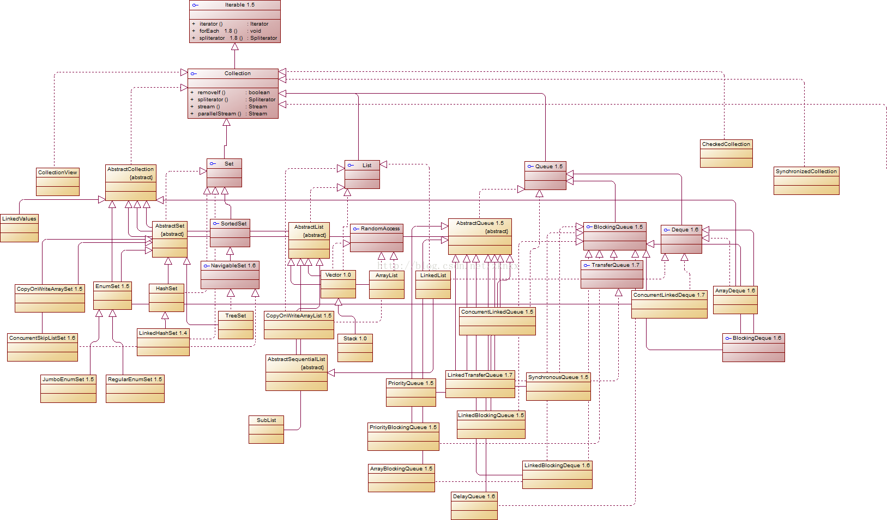
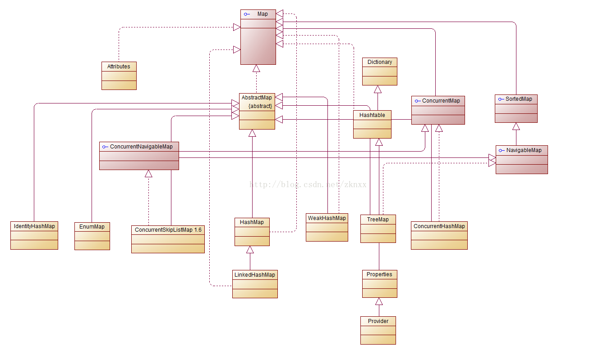

#  JAVA集合概述  
java的集合类主要有两个接口派生而出。这两个接口是java整个集合框架的根接口。  
1、Collection   Collections是Collection的包装类  


2、Map


***
可以吧JAVA集合分为三大类


    a、Set   像一个桶里面装了很多元素。把一个对象添加到Set集合时 set无法记住添加的顺序，所以set中不能有重复的元素出现
    b、List  像一个数组 他可以记住每次添加的顺序，且长度可变
    c、Map   像一个桶，桶里面装的每个元素是基于键值对存放的
***
Collection接口方法列表 

size 
大小 Returns the number of elements in this collection  If this contains more than <tt>Integer.MAX_VALUE</tt> （2<sup>31</sup>-1） elements return  MAX_VALUE
isEmpty 
if this collection contains no elements
contains
if this collection contains the specified element
iterator
迭代器 Returns an iterator over the elements in this collection 
toArray

toArray

add
新增
remove
去除
containsAll

addAll

removeAll

retainAll
去重
clear

equals

hashCode


##  Set 集合  
Set的三个实现类都是县城不安全的 可以通过Collections的synchronizedSortedSet来包装

###  HashSet  
1、不是同步的
2、不能保证元素排列顺序
3、集合元素可以为null
根据元素的hashCode来决定元素存储的位置
HashSet判断元素重复是用对象的equals 和hashCode来判断的
尽量不要去修改插入元素的equals和hashCode方法

###   LinkedHashSet  
同样也是根据hashCode来决定元素存储的位置，只不过是用链表来维护
LinkedHashSet 需要维护元素插入的顺序，所以性能会低于HashSet 
最大的特点就是有序性。元素的顺序与添加的顺序总是一致

###   TreeSet  
确保集合元素处于排序状态
有了排序，就多了很多查找方法，可以访问第一个前一个后一个，并且还可也以查找区间，或者在某个元素之前，或者之后
1、自然排序TreeSet的排序是通过  compareTo方法来比较元素大小关系。然后按升序排列。 即使这两个元素相等，只要compareTo方法返回不相等，就可以插进去
TreeSet中的元素必须实现Comparable接口。
2、定制排序 需要在创建HashSet的时候指定一个实现Comparable的方法.

###   EnumSet  
转为枚举设计的集合类 可以保存多个枚举值， 当试图复制一个Collection集合里的元素来创建EnumSet集合是必须保证Collection里面所有元素都是同一个枚举类的枚举值

### SortSet

接口，有序的接口


###   各类Set实现类的性能分析  
HashSet TreeSet
HashSet的新能总是比TreeSt好，常用的添加、查询元素等操作， hashSet是通过hash值来查询，TreeSet需要额外通过红黑树算法来维护几何元素的次序。
当需要保持排序的时候用TreeSet，否则都应该用HashSet

HashSet和LinkedHashSet 之间的区别是 对于遍历元素而言 LinkedHashSet会更快，而对于增删改查的话hashSet还是慢


##   List 集合  
代表一个元素有序、可重复的集合，可以通过索引来访问指定位置的元素。
###   ArrayList 和 Vector  
这两个实现类都是基于数组实现的List类 封装了一个动态的允许再分配的Object[]  都可以使用 initialCapacity。 
对于通常情况下少量的无序关心 initialCapacity  对于大量的数据则需要指定initialCapacity来提高性能。 不指定的话默认为10 
这两个实现类提供了两个方法来重新分配数组  ensureCapacity   和 trimToSize() 
尽量少使用Vector  
ArrayList 线程不安全， Vector线程安全， 即使这样也不推荐用ArrayList。

###  Arrays 数组操作巩固  
Arrays.ArrayList  是一个固定长度的list集合，他不是ArrayList 和 Vector 实现类 而是Arrays内部的一个ArrayList的实例。
该list只可访问，不可以做写的操作。


##  Queue 集合  
此集合用于模拟队列这种数据结构  FIFO的容器。
###  PriorityQueue实现类  
比较标准的队列实现类，他的特点是对于进入集合的元素进行重排序 -按照大小重排序 也可以定制排序，需要在创建队列时传入一个Comparable对象的实现类

###  Deque接口与ArrayDeque实现类 双端队列  
基于数组实现的双端队列ArrayDeque 该类可以当成双端队列，也可以当成栈来使用

###  LinkedList实现类   
实现了List 可以根据索引来随机访问，除此之外还实现了Deque 可以当成双端队列来使用

这个实现类对于插入比较快，但对于查找就没那么快了

### BlockQueue和BlockDeque

BlockingQueue，进出口单一明确。队列尾部进入队列，队列头部出队列。FIFO

BlockingDequeu 双端阻塞队列，两端都可以进队列，也可以出队列

BlockingDequeu继承了BlockQueue和Queue

###  敲黑板   
链表和数组 数据结构的概念
链表可以存在不是连续的内存区域，他是一个节点一个节点存放的，一个Node包含如下三个元素
`       E item; //存放元素
​        Node<E> next; //存放元素的上一个元素
​        Node<E> prev; //存放元素的下一个元素
`
数组则是存放在内存的连续区域中。 

## 各种线性表的性能分析   
ArrayList和LinkList 前者基于数组，后者基于链表
Queue和Deque 前者是队列  后者是双端队列 可以作为栈来使用

数组查询效率高，链表修改效率高。 !!!这里留一个问题，时间复杂度的问题。

关于使用List集合有如下建议：
如果需要遍历集合元素 对于ArrayList和Vector 应该使用随机访问来遍历集合元素，
​                   对于LinkedList 则应该采用迭代器来遍历集合元素。
如果需要经常执行插入删除 则考虑使用LinkedList，使用ArrayList和Vector可能会重新分配数组大小，效果差

如果多线程需要同时访问，则需要用collections来包装集合来打到线程安全
​                   

##  Map集合   
Set与Map之间的关系非常密切，Map存放的是键值对，Set中存放点单个元素，
实际上Java源码中是先实现了HashMap、TreeMap 然后通过包装一个所有value都为null的Map就实现了Set

map可以理解为类似的List   元素与元素之间可以重复 只不过List使用整数来做索引，Map中使用key做索引。 如果重复添加，key的value会被下一个替换。

###  HashMap和HashTable   
HashMap和HashTable都是Map接口实现，
区别是HashMap线程不安全，HashTable线程安全
HashTable不允许null作为key和value
HashMap允许null作为key和value
尽量不要用Hashtable ，如果要线程安全，请用coleections工具类把HashMap封装成线程安全。
Map的Key必须实现HashCode和equals 方法
因为HasMap和Hashtable中判断元素，或者key相等的方法就是一句equals方法区判断。
### LinkedHashMap   
LinkedHashMap 也是使用双向链表来维护key-Value的次序。
LinkedHashMap可以避免对HashMap 和Hashtable 里key-value的排序 只要插入顺序是你想要的顺序即可。同事又可避免使用TreeMap所增加成本。
需要维护元素插入顺序，所以没有HashMap性能好。
###  Properties类读写属性文件   
Properties类是Hashtable的子类，该对象通常用来处理属性文件。
###  SortMap和TreeMap实现类   
TreeMap是SortMap的实现类
TreeMap是一个红黑树数据结构，每个key-value对作为**红黑树**的第一个节点，存储键值对的时候需要对key进行排序
排序也分两种，

1、自然排序，所有Key必须实现Conparable接口

2、定制排序，定制排序只要传入Comparator对象，该对象负责排序。

###  WeakHashMap    
与HashMap用法基本相似，不同点是HashMap的Key保留了对实际对象的**强引用**，这意味着只要HashMap不被删除，该HashMap的所有key多引用的对象就不会被垃圾回收
HashMap也不会自动删除这些key对应的数据，但WeakHashMap的key只保留了对实际对象的弱引用。这意味着如果key对象没有其他变量强引用，则这个keu很可能会被weakHashMap自动删除这些key
所对应的value

###  IdentityHashMap 实现类
与HashMap相似，但是他处理两个key相等情况时比较特殊。 在IdentityHashMap中当且仅当两个Key严格相等（key1==key2）时IdentityHashMao才会认为他相等，也就是比较
两个对象的引用。

###  EnumMap实现类
EnumMap是一个与枚举类一起使用的Map  其中所有key都必须是单个枚举类的枚举值。创建EnumMap时必须显示或者隐式的指定他的枚举类
enumMap内部以数组形式保存，所以这种实现形式非常紧凑高效。
EnumMap根据key的自然顺序排序，也就是编码时的顺序，enumMap 默认维护的顺序就是enum的顺序。

## 各个Map实现类的性能分析。
<table>
<tr>
<td>实现类</td>
<td>优点</td>
<td>缺点</td>
</tr>
<tr>
<td>HashMap</td>
<td>插入速度快，性能好</td>
<td>线程不安全</td>
</tr>
<tr>
<td>HashTable</td>
<td>线程安全</td>
<td>效率低</td>
</tr>
<tr>
<td>TreeMap</td>
<td>key有序</td>
<td>插入，删除效率较前两个慢</td>
</tr>
<tr>
<td>EnumMap</td>
<td>性能最好</td>
<td>Key要指定Enum类</td>
</tr>
</table>  

  HashMap   
  HashMap比HashTable 要快，因为HashTable是线程安全的。
  TreeMap比HashMap、HashTable 要慢，因为他采用红黑树来管理。
  TreeMap的优点就是总是保持key处于排序状态

  一般情况来说，建议用HashMap，以为正式为快速查询设计的，如果说需要一个个排好序的map则用treeMap


LinkedHashMap 比hashMap慢  因为他需要维护一个添加顺序。

IdentityMap没有什么特别出色的，特点就是key 比较的是引用。

Enump性能最好。

## HashMap 和HashSet 的性能选项

​	对于HashSet及其子类而言，他们采用hash算法来决定集合中元素的存储位置，并通过hash算法来控制集合的大小。对于HashMap、Hashtable及其子类而言，他们采用hash算法来决定Map中key的存储，并通过hash算法来增加key集合的大小。

​	hash表里面可以存储元素的位置被称为桶 在通常情况下每个桶只存放一个元素，可是当发生hash冲突时单个桶会存储多个元素，这些元素以链表形式存储，必须按顺序搜索。

​	因此，hashSet和HashMap、Hashtable都用hash算法来决定其元素的存储。 

hash表的属性如下

- 容量（capacity）hash表中桶的数量    MAXIMUM_CAPACITY  1 << 30  
- initial capacity 初始化容量  DEFAULT_INITIAL_CAPACITY 1 << 4    MUST be a power of two.
- size 当前记录数量
- load factor 负载因子，轻负载的hash表具有冲突少，适宜插入语查询，但是使用Iterator迭代元素时比较慢
- hash表中还有个负载极限，是一个0-1的实质，决定了最大填满程度 DEFAULT_LOAD_FACTOR 0.75f 当填满0.75f的时候回refresh 这个时候会成倍的增长。 较高的负载会增加查询数据的开销，较低的负载会增加占用内存的开销。


## 深入理解HashMap

Hash表 中  是数组+链表的存储方式  链表为单向链表 横向为数组，纵向为列表。

jdk1.8之后将链表改为红黑树实现 如果链表长度超过8 将其变为红黑树，

  基本元素 node（1.8） 中有key value  next hash   entry（1.7）


hash算法   是用来计算存储下下标。根据hash算法得到一个整数， 控制数值在initcapacity中 （默认0-15）。

Key.hashCode()   int类型  32位

JDK1.8   用这个hashCode 高16位和低16位进行一个***异或运算***。运算之后得到一个结果，

将hashCod向右移位16位，左边补0，然后与原来的hashCode进行异或

```java
(h = key.hashCode()) ^ (h >>> 16)
```

JDK1.7 

```
h ^= (h >>> 20) ^ (h >>> 12);
return h ^ (h >>> 7) ^ (h >>> 4);
```


put方法的过程（1.8）

获取下标位置 hash & （n-1） 为什么不用取模而去进行与运算，因为与运算效率高 

然后判断hash算法是否一致，一致之后判断hashCode是否一致，如果不一致，在此node后面追加节点

如果节点不是红黑树，就按链表，如果链表元素超过8 则转换成红黑树


最后判断数组容量大小   如果大于loadcapacity 需要扩容 变大是两倍大小

扩充一个和原来一样大的数组， 将原来的数组内容移动到新的数组

分三种情况

1. 下标存在，且没有next 。
2. 下标有值，next为红黑树。
3.  下标有值，next为链表。

**<u>重新分配链表的时候很有意思</u>**


## Collections工具类

​	操作集合的工具类，该工具类提供了大量的方法来对集合元素进行排序、查询和修改等操作，还提供了将集合对象设置为不可变、对集合对象实现同步控制的方法。

### 排序操作

-  reverse  Reverses the order of the elements in the specified list  反转列表

-  shuffle  Randomly permutes the specified list using a default source of randomness 对集合中元素进行随机排序

-  sort（list） Sorts the specified list into ascending order natural ordering 根据元素的自然顺序对list重排序

-  sort（list，Comparator）根据comparator产生的顺序对list重排序

-  swap (i,t) 交换i和t

-  rotate(List<?> list, int distance) 如果distance 为正数时，架构后distance个元素整体移到前面，如果为负数将前distance 个元素整体移到后面，不会影响集合长度。


### 查找替换操作

-  binarySearch(List<? extends Comparable<? super T>> list, T key)  二分法搜索指定的List集合 以获得指定对象在List集合中的索引。如果要使该方法可以正常工作，必须保证List中的元素处于有序状态
-  replaceAll 使用一个新的value替换所有旧的value

### 同步控制

- synchronizedXxx 直接获取线程安全的集合

### 设置不可变集合

emptyXxx（）

singletonXxx（）


​    

​	


