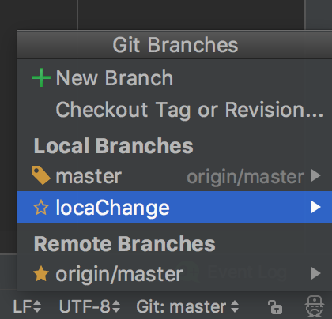
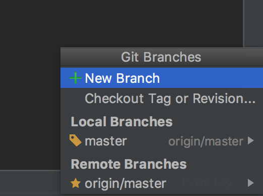
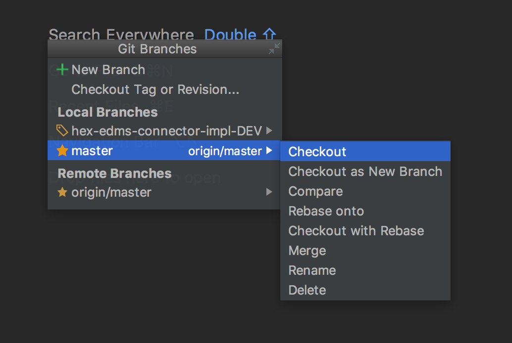
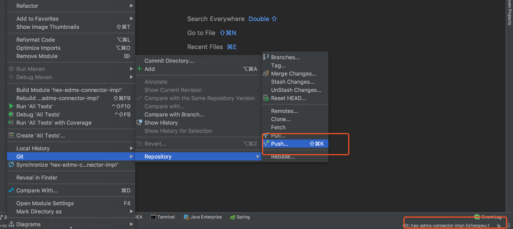

# Git 操作手册

​	背景：都说git好，那就用用试试吧。由于我之前所有的项目都是svn的，故记录一下如何理解并使用git这个分布式版本管理工具。

​	分布式管理工具怎么理解呢，就是大家每个人都是一个slave节点，每个人都有自己的本地库用来存放自己修改的版本。然后当你确定没问题了，再push到你的git服务器上也就相当于master节点。（这种理解不一定对，只是方便我个人理解而已，官方给出的解释是  有三个工作区域的概念 ：Git 仓库、工作目录以及暂存区域。）

​	git分服务端有 github、gitlab、Gogs。我公司用的是Gogs。

> Git的功能特性：

> 从一般开发者的角度来看，git有以下功能：

> 1、从服务器上克隆完整的Git仓库（包括代码和版本信息）到单机上。

> 2、在自己的机器上根据不同的开发目的，创建分支，修改代码。

> 3、在单机上自己创建的分支上提交代码。

> 4、在单机上合并分支。

> 5、把服务器上最新版的代码fetch下来，然后跟自己的主分支合并。

> 6、生成补丁（patch），把补丁发送给主开发者。

> 7、看主开发者的反馈，如果主开发者发现两个一般开发者之间有冲突（他们之间可以合作解决的冲突），就会要求他们先解决冲突，然后再由其中一个人提交。如果主开发者可以自己解决，或者没有冲突，就通过。

> 8、一般开发者之间解决冲突的方法，开发者之间可以使用pull 命令解决冲突，解决完冲突之后再向主开发者提交补丁。

git使用手册https://git-scm.com/book/zh/v2

## Gogs使用

服务器UI新建版本库

​	在控制面板中>我的仓库 点击+   基本上输入个仓库名称就可以，其他选项缺省值就可，注意一点，有的别人的仓库会有.gitignore 这个文件，这个是设置忽略提交规则。如果你想提交的发现修改之后commit列表里面没有，就有可能是忽略提交规则过滤掉了。

创建好版本库之后会有提示操作方法

1、	从命令行创建一个新的仓库。 可以在你需要版本管理的文件夹目录下init一下然后直接推到这个仓库。windows需要在GitBash里面操作。README.md 一般是每个项目的简介。这里只是列举了一个READEME.md 如果你这个文件夹下有很多 直接 git add * 我的是mac  windows添加多个文件具体要去查一下。

```
touch README.md
git init
git add README.md
git commit -m "first commit"
git remote add origin http://XX.XXXXX.XXX:XX/zhengwu.li/test2.git
#git remote add origin http://git服务器地址/用户名/仓库名.git
git push -u origin master


```

执行完上面的命令就代表创建好你的仓库了。


在IDEA或者gitUI中clone下来即可。

### 基本操作 

1、pull更新服务端代码。 pull如果失败，提示会overwrite本地已经修改的文件。如果出现这种情况，会提示revert或者stash，revert回滚不必多说，stash是之前svn没有的概念。stash是暂存本地修改的记录，在IDEA 中git>repository 中选择stashChange  暂存修改的，然后pull即可。pull完再unStashChange pop出你的stash就可以了。unStashChange的过程中可能会有冲突，所以需要merge冲突即可。

2、commit 提交变更至本地仓库。

3、push 推送至远程仓库，可一次推送多条commit记录。

以上是最简单的三部曲，拉代码，提交本地仓库，提交远程仓库。这是最基本的了。比之前用的SVN多了一步。

那么为什么多出来这一步呢。下面讲一下高端的啊。

### 分支

一个仓库可以有很多分支，分支有本地分支，和远程分支， 在IDEA右下角


可以看出分支的类别：

本地分支，一般场景是临时创建本地分支，然后merge到远程某个分支，用于自己的代码在本地的版本管理。

远程分支，建议每个人都有自己的分支，然后再合并到一个version分支上，然后再pull Request到master。

***gogs不支持管理页面创建分支，只支持推送分支。***也就是说创建完本地分支，开发完直接推送至服务器端，就可以看到自己新建的分支。

一般来说分支的结构有 

```
主分支（master）-------------------------------------------

发布分支-----------------------------------------

开发分支（hex-edms-connector-impl-DEV）-----------------------------------------

个人分支（hex-edms-connector-impl-lizhengwu）-----------------------------------------

```


流程应该是，大家开发应该都在个人分支上开发，然后提交到自己的服务器分支上，然后再pullrequest到开发分支。合并完成之后大家再pull开发分支。

创建本地分支，自己起名字



​	切换分支在IDEA右下角用checkout ***注意：切换分支的时候当前未上传到暂存区的代码（本地修改还没有commit）会带到你要求换的那个分支上去***，所以建议切换分支的时候如果有还没有提交的代码，要stash一下。保存一下当前工作状态，然后切换分支，进行merge。merge是从指定分支合并到自己的分支上。



创建本地分支后，并且切换到本地新建的分支。然后push到远端，就可以在远程创建分支了。这个分支以后就是你的开发分支了。




### **分支的原理**

分支的过程及原理如下：

1、只有master分支的话，而HEAD指针指向的是master的最新版本的。

创建了一个新的Branch 后，master和testing都指向当前最新版本。


git checkout testing

切换分支。此时HEAD就指向了testing分支。


当前，在testing分支上开发后提交到暂存区的话，当前testing 的HEAD会在最新的版本号上。


如果此时再切回老的分支，HEAD会回到当时master分支的最新版本。


此时，如果再对master进行修改，提交的话会产生以下情况。


master修改的情况有很多种，比如说出现了个bug需要紧急修复，就在原来的master上开一个修复bug的分支，bug修复完，测试完之后，合并到master下，就会出现master的最新版本号，比当时创建testing（iss53）分支的版本要新。


当iss53分支开发完成后，需要合并到master的时候。 merge一下就好

```console
git merge iss53
```


出现这种情况的时候，Git 会使用两个分支的末端所指的快照（`C4` 和 `C5`）以及这两个分支的工作祖先（`C2`），做一个简单的三方合并。


和之前将分支指针向前推进所不同的是，Git 将此次三方合并的结果做了一个新的快照并且自动创建一个新的提交指向它。 这个被称作一次合并提交，它的特别之处在于他有不止一个父提交。


任何因包含合并冲突而有待解决的文件，都会以未合并状态标识出来。 Git 会在有冲突的文件中加入标准的冲突解决标记，这样你可以打开这些包含冲突的文件然后手动解决冲突。 出现冲突的文件会包含一些特殊区段，看起来像下面这个样子：

```html
<<<<<<< HEAD:index.html
<div id="footer">contact : email.support@github.com</div>
=======
<div id="footer">
 please contact us at support@github.com
</div>
>>>>>>> iss53:index.html
```

这表示 `HEAD` 所指示的版本（也就是你的 `master` 分支所在的位置，因为你在运行 merge 命令的时候已经检出到了这个分支）在这个区段的上半部分（`=======` 的上半部分），而 `iss53` 分支所指示的版本在 `=======` 的下半部分。 为了解决冲突，你必须选择使用由 `=======` 分割的两部分中的一个，或者你也可以自行合并这些内容。 例如，你可以通过把这段内容换成下面的样子来解决冲突：

### Merge

我个人认为最重要的还是Merge 大家再自己的分支开发都很简单，现在用场景来描述一下，目前一个开发版DEV_V1.0 有3个人在协作。A、B、C。A修改一个模块，B修改一个模块，C修改一个模块都在自己的分支上

A每次开发完成，自测完成，提交到自己的分支上之后，然后切换到开发分支，将你自己的分支merge到开发分支上。

当你在本地开发提交的时候HEAD一直在你的分支，最新版本，你切到DEV之后，DEV的HEAD在他的最新版本，然后你要用DEV和你的开发分支合并，这样开发分支就和你的分支都是最新版本了。

### Rebase

git rebase [basebranch][topicbranch]

把修改的分支变基到主分支上，然后再在主分支上merge修改分支，实际上与直接merge修改分支没有太大的区别，只是在修改日志体现不同，rebase后日志不会出现merge的记录，而直接merge会在开发日志中体现出merge的日志。

总的原则是，只对尚未推送或分享给别人的本地修改执行变基操作清理历史，从不对已推送至别处的提交执行变
基操作，这样，你才能享受到两种方式带来的便利。


不用`--no-ff`，实际上只是将master的指针update成dev分支而已，用的还是dev的commit ID，而使用之后，则是重新commit了一哈，有了新的commit ID

## GIT命令

在当前分支的基础上切换并新建分支。

```console
git checkout -b iss53
```

上面那条命令相当于下面两条命令的缩写

```console
$ git branch iss53
$ git checkout iss53
```

删除分支

```console
$ git branch -d hotfix
```

git fetch    它只会获取数据然后让你自己合并。

git pull 在大多数情况下它的含义是一个 git fetch 紧接着一个git merge 命令


删除分支

```console
git push origin --delete branchName
```